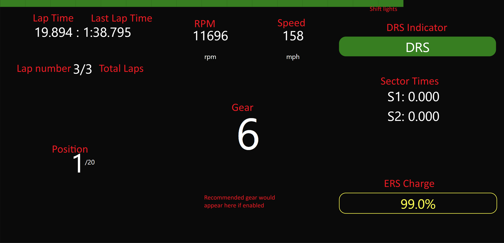

# F1 23 Dashboard

A dashboard for F1 23.

## Running
Requires the dotnet sdk 8 and nodejs 16 to be installed.

Run the `run.bat` file via file explorer or command line.
The first run may take a while and internet access is only required for the first run.

Make sure to configure your F1 game to enable telemetry and set the IP address to your computer if
the computer is not the same as the one running the game.

Once running, the application will give you a link to open on your web browser or on another device on the same network.

## Screenshot with annotations

